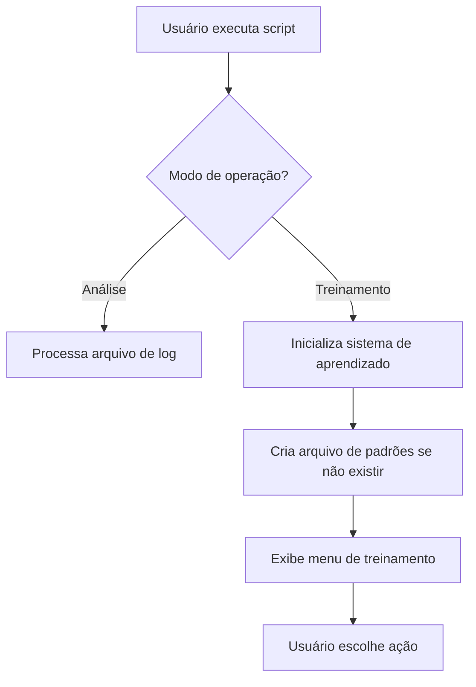
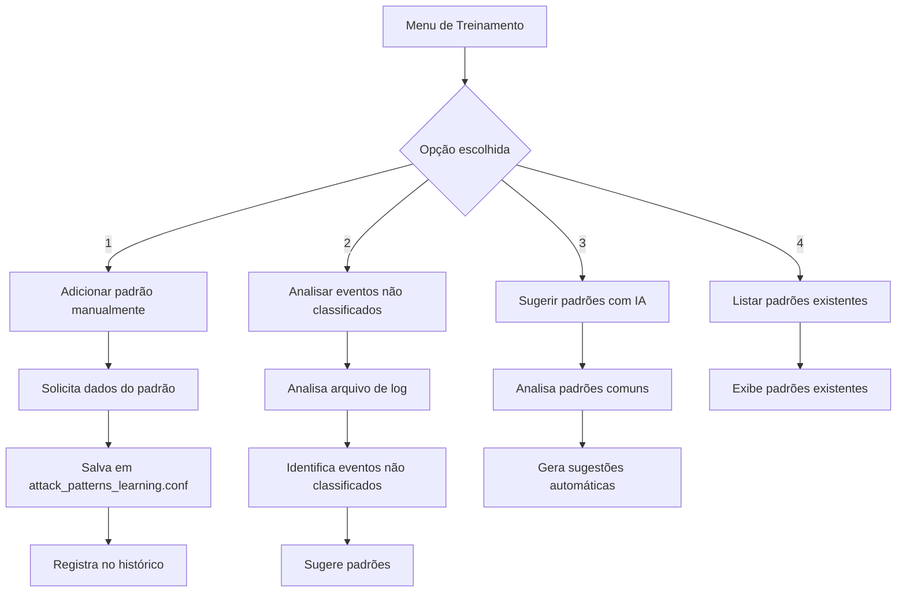
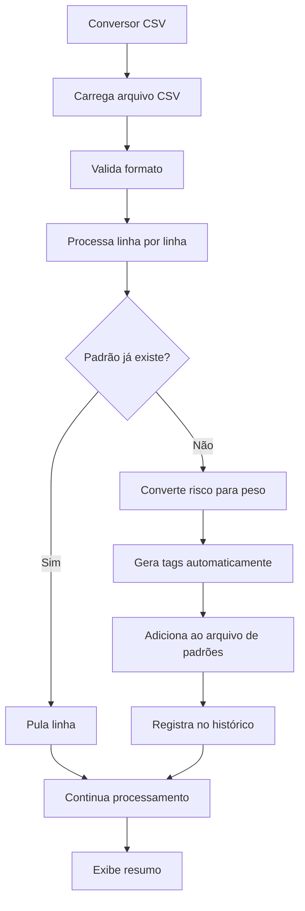
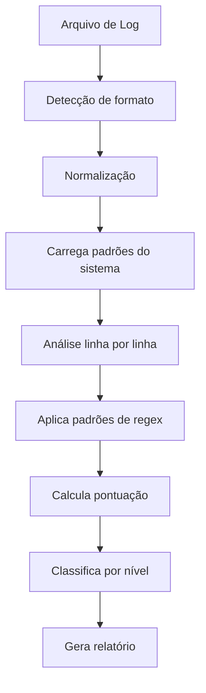

# 🔄 FLUXO DO SISTEMA DE TREINAMENTO - ANÁLISE DE LOGS

## 📋 Visão Geral

O **Sistema de Treinamento para Análise de Logs** é um conjunto de ferramentas que permite treinar e expandir a capacidade de detecção de ameaças do script principal. O sistema funciona de forma modular, permitindo adicionar novos padrões de detecção, importar em lote via CSV e manter um histórico de todas as operações.

**Autor:** Jackson Savoldi  
**Professor:** Erick Martinez  
**Curso:** ACADe-TI - Aula 04 (28/06/2025)

---

## 🏗️ Arquitetura do Sistema

### 📁 Estrutura de Arquivos

```
logs/
├── scriptlogs_avancado.sh          # Script principal (análise + treinamento)
├── csv_to_training_system.sh       # Conversor CSV para padrões
├── train_log_analyzer.sh           # Sistema de treinamento inteligente
├── attack_patterns_learning.conf   # Base de padrões de ataque
├── import_history.log              # Histórico de importações CSV
├── training_history.log            # Histórico de treinamentos
├── payloads_patterns.csv           # Exemplo de CSV para importação
└── exemplo_cadastro_rg.txt         # Exemplos de padrões
```

### 🔧 Componentes Principais

| Componente | Função | Arquivo |
|------------|--------|---------|
| **Script Principal** | Análise de logs + treinamento | `scriptlogs_avancado.sh` |
| **Conversor CSV** | Importação em lote | `csv_to_training_system.sh` |
| **Base de Padrões** | Armazenamento de regex | `attack_patterns_learning.conf` |
| **Históricos** | Rastreamento de operações | `*.log` |

---

## 🔄 Fluxo de Funcionamento

### 1. **Inicialização do Sistema**



### 2. **Sistema de Treinamento**



### 3. **Importação em Lote (CSV)**



### 4. **Análise de Logs**



---

## 🎯 Como o Usuário Interage

### 1. **Modo de Treinamento**

```bash
# Ativar modo de treinamento
./scriptlogs_avancado.sh -train

# Menu interativo:
# 1) Adicionar padrão manualmente
# 2) Analisar eventos não classificados  
# 3) Sugerir padrões com IA
# 4) Listar padrões existentes
```

**Exemplo de adição manual:**
```
Regex/Pattern: admin.*login
Categoria: ALTO
Descrição: Tentativa de login admin
Peso: 7
Tags: admin,login,web
```

### 2. **Importação em Lote**

```bash
# Executar conversor CSV
./csv_to_training_system.sh

# Menu interativo:
# 1) Importar CSV de payloads
# 2) Ver estatísticas dos padrões
# 3) Exportar padrões para CSV
# 4) Ver histórico de importações
```

**Formato do CSV esperado:**
```csv
payload,attack,technique,objective,risk
"<script>alert('XSS')</script>","XSS Refletido","Script Injection","Executar alert","High"
"admin' OR '1'='1","SQL Injection","Boolean Based","Bypass authentication","Critical"
```

### 3. **Análise de Logs**

```bash
# Análise básica
./scriptlogs_avancado.sh -v logs.log

# Análise completa
./scriptlogs_avancado.sh -v -t -aR -gT -pedago -pcn -peso -correl -r relatorio.html logs.log
```

---

## 📊 Formato dos Padrões

### Estrutura do Arquivo `attack_patterns_learning.conf`

```
PADRÃO|CATEGORIA|DESCRIÇÃO|PESO|TAGS
```

**Exemplo:**
```
admin.*login|ALTO|Tentativa de login admin|7|admin,login,web
<script.*alert|ALTO|XSS com alert|7|xss,script,alert
rm -rf|CRÍTICO|Comando destrutivo|10|destruction,delete,crítico
```

### Classificação por Peso

| Nível | Pontos | Descrição |
|-------|--------|-----------|
| 🔴 **CRÍTICO** | 10 | Ameaças graves que comprometem a segurança |
| 🟣 **ALTO** | 7 | Ameaças significativas que requerem atenção |
| 🟡 **MÉDIO** | 4 | Ameaças moderadas que devem ser monitoradas |
| 🔵 **BAIXO** | 1 | Atividades suspeitas de baixo impacto |
| 🟢 **INFO** | 0 | Atividades normais do sistema |

---

## ⚠️ Pontos de Atenção e Possíveis Erros

### 1. **Problemas de Permissão**
```bash
# Verificar permissões
ls -la *.sh
chmod +x *.sh  # Se necessário
```

### 2. **Dependências Ausentes**
```bash
# Verificar dependências
for cmd in grep awk sed sort uniq curl jq; do
    command -v "$cmd" || echo "❌ $cmd não encontrado"
done
```

### 3. **Formato de CSV Incorreto**
- **Problema:** CSV com formato diferente do esperado
- **Solução:** Verificar cabeçalho e separadores
- **Formato correto:** `payload,attack,technique,objective,risk`

### 4. **Padrões Duplicados**
- **Problema:** Mesmo padrão adicionado múltiplas vezes
- **Solução:** Sistema verifica automaticamente, mas sempre conferir
- **Verificação:** `grep "padrão" attack_patterns_learning.conf`

### 5. **Arquivo de Log Vazio ou Inacessível**
```bash
# Verificar arquivo
ls -la logs.log
wc -l logs.log  # Deve ter linhas
```

### 6. **Regex Malformado**
- **Problema:** Padrão regex inválido
- **Solução:** Testar regex antes de adicionar
- **Teste:** `echo "texto" | grep "regex"`

---

## 🔧 Comandos Úteis para Debug

### Verificar Estado do Sistema
```bash
# Verificar arquivos de configuração
ls -la *.conf *.log

# Verificar padrões existentes
wc -l attack_patterns_learning.conf

# Verificar histórico
tail -10 training_history.log
tail -10 import_history.log
```

### Testar Padrões
```bash
# Testar um padrão específico
grep "admin.*login" attack_patterns_learning.conf

# Contar padrões por categoria
grep -c "CRÍTICO" attack_patterns_learning.conf
grep -c "ALTO" attack_patterns_learning.conf
```

### Backup e Restauração
```bash
# Backup dos padrões
cp attack_patterns_learning.conf backup_$(date +%Y%m%d).conf

# Restaurar backup
cp backup_20250629.conf attack_patterns_learning.conf
```

---

## 📈 Fluxo de Trabalho Recomendado

### 1. **Configuração Inicial**
```bash
# 1. Verificar dependências
./scriptlogs_avancado.sh --help

# 2. Testar com arquivo de exemplo
./scriptlogs_avancado.sh -v -pedago logs_analise.txt

# 3. Verificar padrões existentes
./scriptlogs_avancado.sh -train
# Opção 4: Listar padrões existentes
```

### 2. **Treinamento do Sistema**
```bash
# 1. Adicionar padrões específicos
./scriptlogs_avancado.sh -train
# Opção 1: Adicionar padrão manualmente

# 2. Importar padrões em lote
./csv_to_training_system.sh
# Opção 1: Importar CSV de payloads

# 3. Verificar estatísticas
./csv_to_training_system.sh
# Opção 2: Ver estatísticas dos padrões
```

### 3. **Análise de Logs**
```bash
# 1. Análise básica
./scriptlogs_avancado.sh -v arquivo.log

# 2. Análise completa
./scriptlogs_avancado.sh -v -t -aR -gT -pedago -pcn -peso -correl arquivo.log

# 3. Gerar relatório HTML
./scriptlogs_avancado.sh -v -r relatorio.html arquivo.log
```

---

## 🎯 Dicas de Uso

### 1. **Padrões Eficazes**
- Use regex específicos, não genéricos
- Teste padrões antes de adicionar
- Mantenha descrições claras e concisas
- Use tags relevantes para categorização

### 2. **Organização**
- Mantenha backup regular dos padrões
- Documente padrões complexos
- Revise padrões periodicamente
- Remova padrões obsoletos

### 3. **Performance**
- Evite padrões muito complexos
- Use quantificadores apropriados
- Considere o impacto em logs grandes
- Monitore tempo de processamento

---

## 🚀 Próximos Passos

1. **Testar o sistema atual** com diferentes tipos de log
2. **Identificar padrões faltantes** na análise
3. **Adicionar novos padrões** específicos do ambiente
4. **Criar modelos CSV** para facilitar importação em lote
5. **Documentar padrões específicos** do domínio

---

*Documentação criada por Jackson Savoldi - ACADe-TI 2025* 