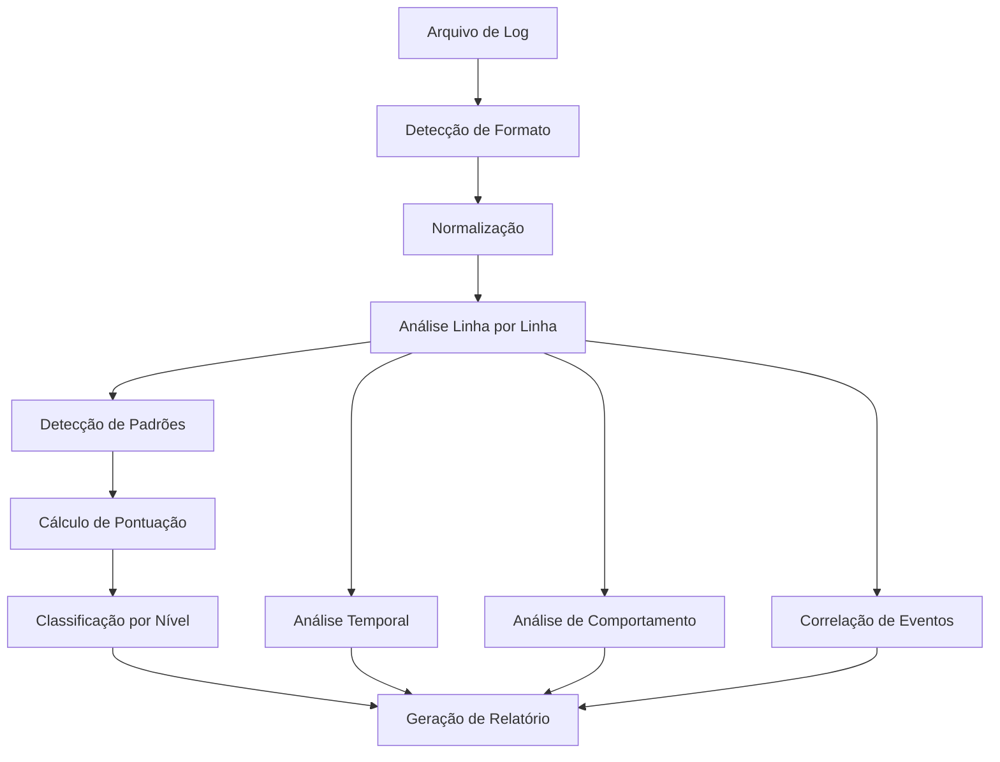

# 📋 Documentação do Sistema de Análise de Logs de Segurança

## 🎯 Visão Geral

O **Script Avançado de Análise de Logs de Segurança e Continuidade de Negócios** é uma ferramenta completa para análise de logs de segurança, desenvolvida para detectar, classificar e analisar ameaças em tempo real.

**Autor:** Jackson Savoldi  
**Professor:** Erick Martinez  
**Curso:** ACADe-TI - Aula 04 (28/06/2025)

---

## 🔍 Sistema de Classificação de Ameaças

### 📊 Estrutura de Pontuação

O sistema utiliza uma **pontuação baseada em pesos** para classificar as ameaças em 5 níveis:

```
┌─────────────┬─────────┬─────────────────────────────────────┐
│   NÍVEL     │ PONTOS  │           DESCRIÇÃO                 │
├─────────────┼─────────┼─────────────────────────────────────┤
│  CRÍTICO    │  10+    │ Ameaças graves que comprometem     │
│             │         │ a segurança do sistema              │
├─────────────┼─────────┼─────────────────────────────────────┤
│  ALTO       │   7-9   │ Ameaças significativas que          │
│             │         │ requerem atenção imediata           │
├─────────────┼─────────┼─────────────────────────────────────┤
│  MÉDIO      │   4-6   │ Ameaças moderadas que devem         │
│             │         │ ser monitoradas                     │
├─────────────┼─────────┼─────────────────────────────────────┤
│  BAIXO      │   1-3   │ Atividades suspeitas de baixo       │
│             │         │ impacto                             │
├─────────────┼─────────┼─────────────────────────────────────┤
│  INFO       │    0    │ Atividades normais do sistema       │
└─────────────┴─────────┴─────────────────────────────────────┘
```

### 🎯 Lógica de Pontuação

```
PONTUAÇÃO TOTAL = Soma de todos os padrões detectados na linha

Exemplo:
- Linha contém: "SQL Injection" (7pts) + "Erro 403" (7pts)
- Pontuação Total: 14 pontos
- Classificação: CRÍTICO (14 ≥ 10)
```

---

## 🚨 Padrões de Ameaças por Categoria

### 🔴 CRÍTICO (10 pontos)

**Ameaças que comprometem diretamente a segurança:**

- **Reverse Shell**: `reverse shell`, `shell\.php`, `backdoor`
- **Privilege Escalation**: `root shell`, `privilege escalation`
- **Data Exfiltration**: `data exfiltration`
- **Command Injection**: `Comando injetado`, `cat /flag`, `whoami`
- **Malicious Commands**: `ls;.*cat`, `rm -rf`, `wget.*http://`

### 🟣 ALTO (7 pontos)

**Ameaças significativas que requerem atenção:**

- **Web Attacks**: `SQL Injection`, `XSS`, `LFI`, `RFI`
- **Command Injection**: `Command Injection`, `Webshell Upload`
- **Brute Force**: `Força bruta`, `Invalid user`, `Failed password`
- **Sensitive Files**: 
  - `Download arquivo:.*senha`
  - `Download arquivo:.*secret`
  - `Download arquivo:.*token`
  - `Download arquivo:.*credential`
  - `Download arquivo:.*data_dump`
- **Path Traversal**: `../../etc/passwd`, `Inclusão remota`
- **Remote Code**: `Fetch remoto`, `http://evil.com`

### 🟡 MÉDIO (4 pontos)

**Ameaças moderadas que devem ser monitoradas:**

- **Port Scanning**: `Port Scan`, `Enumeration`
- **Denial of Service**: `Denial of Service`
- **Authentication Issues**: `Login falha`, `Erro de permissão`
- **Suspicious Activity**: `Suspicious Download`

### 🔵 BAIXO (1 ponto)

**Atividades suspeitas de baixo impacto:**

- **File Operations**: `Upload arquivo`, `Download arquivo`
- **Database Queries**: `Consulta registro`
- **Authentication**: `Login sucesso`

### 🟢 INFO (0 pontos)

**Atividades normais do sistema:**

- **System Maintenance**: `backup`, `Verificação antivírus`
- **Updates**: `Atualização automática`, `Backup iniciado`

---

## 🔄 Fluxo de Análise



### 📋 Processo Detalhado

1. **Detecção de Formato**: Identifica automaticamente o tipo de log (Apache, SSH, MySQL, Nginx, Custom)

2. **Normalização**: Converte todos os formatos para um padrão único

3. **Análise Linha por Linha**: 
   - Processa cada linha individualmente
   - Aplica todos os padrões de detecção
   - Calcula pontuação total

4. **Classificação**: 
   - Soma todos os padrões encontrados
   - Classifica baseado na pontuação total
   - Aplica cores e formatação

---

## 🛠️ Funcionalidades Principais

### 📊 Análise Linha por Linha (`-v`)
- Exibe cada linha processada com classificação
- Mostra padrões detectados e pontuação
- Formatação colorida por nível de ameaça

### 🌐 Explicação de IPs (`-t`)
- Identifica IPs TEST-NET (RFC5737)
- Geolocalização de IPs externos
- Explicação de redes privadas vs públicas

### 🛡️ Recomendações Automáticas (`-aR`)
- Gera sugestões baseadas nos ataques detectados
- Recomendações específicas por tipo de ameaça
- Ações defensivas prioritárias

### ⏰ Timeline Cronológica (`-gT`)
- Análise temporal de eventos
- Identificação de picos de atividade
- Padrões de comportamento ao longo do tempo

### 📚 Modo Pedagógico (`-pedago`)
- Explicações detalhadas das ameaças detectadas
- Formatação didática para aprendizado
- Detalhamento de cada padrão encontrado

### 📘 Plano de Continuidade (`-pcn`)
- Gera seção de continuidade de negócios
- Análise de impacto dos ataques
- Recomendações para recuperação

### 🎯 Análise por Peso (`-peso`)
- Classificação detalhada por peso de ameaça
- Score de risco geral do sistema
- Distribuição estatística por nível

### 🔗 Correlação de Eventos (`-correl`)
- Correlaciona eventos por usuário/IP
- Identifica padrões de comportamento
- Análise de sequências suspeitas

---

## 📈 Score de Risco Geral

### 🎯 Cálculo do Score

```
SCORE = (CRÍTICO × 10) + (ALTO × 7) + (MÉDIO × 4) + (BAIXO × 1)
```

### 🚨 Classificação do Sistema

- **Score ≥ 50**: 🚨 **ALERTA - Sistema em alto risco!**
- **Score ≥ 20**: ⚠️ **ATENÇÃO - Sistema em risco moderado**
- **Score < 20**: ✅ **Sistema em risco baixo**

---

## 🎨 Sistema de Cores

### 🔴 CRÍTICO
- **Cor**: Vermelho
- **Estilo**: Piscante + Negrito
- **Emoji**: 🔴

### 🟣 ALTO
- **Cor**: Magenta
- **Estilo**: Negrito
- **Emoji**: 🟣

### 🟡 MÉDIO
- **Cor**: Amarelo
- **Estilo**: Negrito
- **Emoji**: 🟡

### 🔵 BAIXO
- **Cor**: Azul
- **Estilo**: Negrito
- **Emoji**: 🔵

### 🟢 INFO
- **Cor**: Verde
- **Estilo**: Negrito
- **Emoji**: 🟢

---

## 📋 Exemplo de Uso

```bash
# Análise completa com todas as funcionalidades
./scriptlogs_avancado.sh -v -t -aR -gT -pedago -pcn -peso -correl -r relatorio.html logs.log

# Análise básica
./scriptlogs_avancado.sh -v logs.log

# Análise com modo pedagógico
./scriptlogs_avancado.sh -v -pedago logs.log
```

---

## 🔧 Dependências

- **grep**: Busca de padrões
- **awk**: Processamento de texto
- **sed**: Edição de texto
- **sort**: Ordenação
- **uniq**: Remoção de duplicatas
- **curl**: Requisições HTTP
- **jq**: Processamento JSON

---

## 📊 Formato de Saída

### Tabela de Análise
```
Linha  | Timestamp           | IP              | Usuário     | Peso  | Nível   | Ação
--------------------------------------------------------------------------------------------------------
1      | 2025-06-25 09:00:00 | 192.168.1.1     | user1       | 14    | CRÍTICO | SQL Injection detectada
    ➔ Ameaças detectadas: SQL Injection : 7pts Erro 403 : 7pts
--------------------------------------------------------------------------------------------------------
```

### Estatísticas
```
📈 Distribuição por Nível de Ameaça:
  🔴 CRÍTICO: 3 eventos
  🟣 ALTO: 7 eventos
  🟡 MÉDIO: 12 eventos
  🔵 BAIXO: 25 eventos
  🟢 INFO: 8 eventos
  📊 TOTAL: 55 eventos

🎯 Score de Risco Geral: 156 pontos
🚨 ALERTA: Sistema em alto risco!
```

---

## 🚀 Melhorias Futuras

- [ ] Detecção de padrões mais avançados
- [ ] Machine Learning para classificação
- [ ] Integração com SIEM
- [ ] Dashboard web interativo
- [ ] Alertas em tempo real
- [ ] Análise de logs em lote
- [ ] Suporte a mais formatos de log

---

*Documentação criada por Jackson Savoldi - ACADe-TI 2025* 