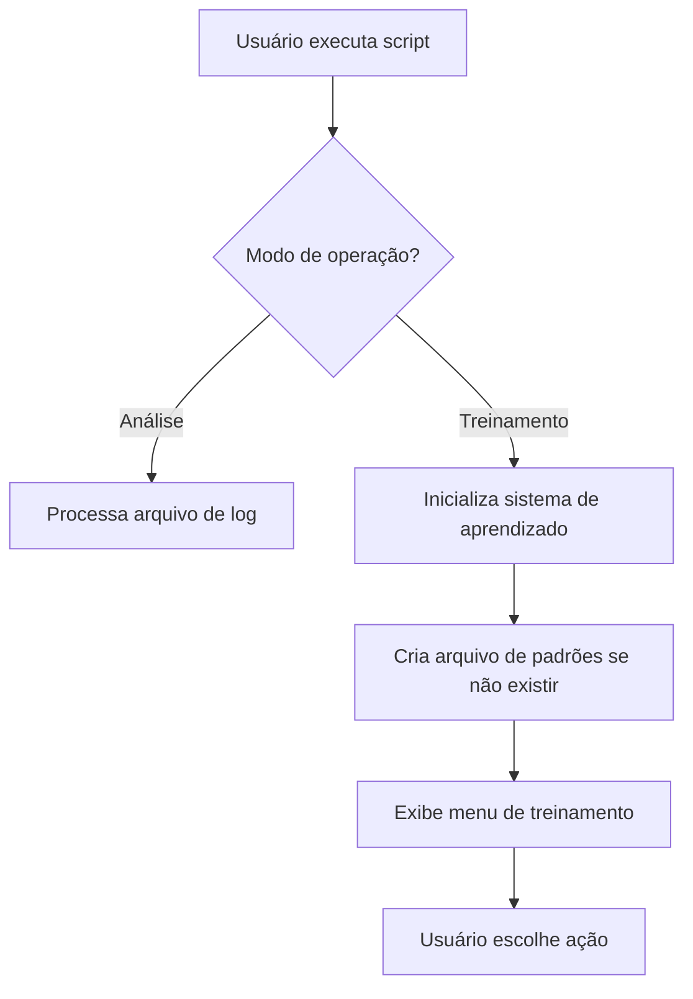
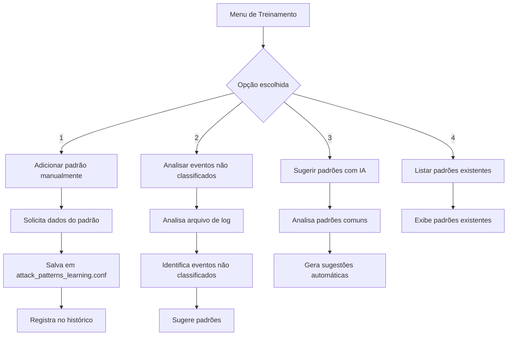
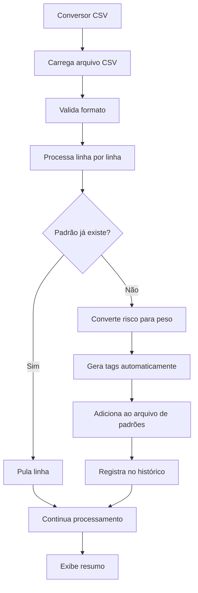
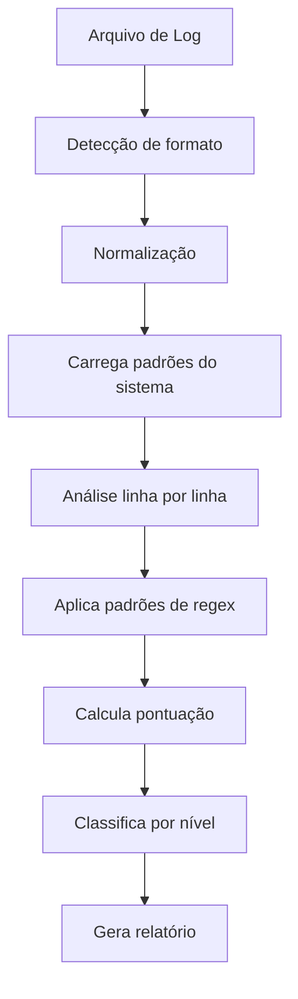

# 🔄 FLUXO DO SISTEMA DE TREINAMENTO - ANÁLISE DE LOGS

## 📋 Visão Geral

O **Sistema de Treinamento para Análise de Logs** é um conjunto de ferramentas que permite treinar e expandir a capacidade de detecção de ameaças do script principal. O sistema funciona de forma modular, permitindo adicionar novos padrões de detecção, importar em lote via CSV e manter um histórico de todas as operações.

**Autor:** Jackson Savoldi  
**Professor:** Erick Martinez  
**Curso:** ACADe-TI - Aula 04 (28/06/2025)

---

## 🏗️ Arquitetura do Sistema

### 📁 Estrutura de Arquivos

```
logs/
├── config/                          # Configurações centralizadas
│   ├── main.conf                    # Configuração principal
│   ├── paths.conf                   # Caminhos do projeto
│   ├── patterns.conf                # Padrões de detecção
│   └── attack_patterns_learning.conf # Base de padrões de ataque
├── src/scripts/                     # Código fonte dos scripts
│   ├── core/                        # Scripts principais
│   │   ├── scriptlogs.sh            # Script básico de análise
│   │   ├── scriptlogs_avancado.sh   # Script principal (análise + treinamento)
│   │   └── scriptlogs_sem_jq.sh     # Script sem dependência do jq
│   ├── generators/                  # Geradores de conteúdo
│   │   └── gerador_logs_realistas.sh # Gerador de logs realistas
│   └── utils/                       # Utilitários
│       ├── config_loader.sh         # Carregador de configuração
│       └── csv_to_training_system.sh # Conversor CSV para padrões
├── system/                          # Sistema de treinamento
│   ├── backup/                      # Backups automáticos
│   ├── data/                        # Dados do sistema
│   │   ├── exports/                 # Exportações de padrões
│   │   ├── import/                  # Importações CSV
│   │   └── templates/               # Templates
│   └── logs/                        # Logs do sistema
│       ├── import_history.log       # Histórico de importações CSV
│       └── training_history.log     # Histórico de treinamentos
├── analogs/                         # Logs para análise
│   ├── attacks/                     # Logs de ataques
│   ├── custom/                      # Logs customizados
│   ├── examples/                    # Exemplos de logs
│   ├── logs_realistas/              # Logs realistas
│   └── services/                    # Logs por serviço
└── payloads/                        # Payloads para desenvolvimento
    ├── sql-injection-payload-list/  # Payloads SQL injection
    └── xss/                         # Payloads XSS
```

### 🔧 Componentes Principais

| Componente | Função | Arquivo |
|------------|--------|---------|
| **Script Principal** | Análise de logs + treinamento | `src/scripts/core/scriptlogs_avancado.sh` |
| **Conversor CSV** | Importação em lote | `src/scripts/utils/csv_to_training_system.sh` |
| **Base de Padrões** | Armazenamento de regex | `config/attack_patterns_learning.conf` |
| **Carregador Config** | Carregamento de configuração | `src/scripts/utils/config_loader.sh` |
| **Históricos** | Rastreamento de operações | `system/logs/*.log` |

---

## 🔄 Fluxo de Funcionamento

### 1. **Inicialização do Sistema**



### 2. **Sistema de Treinamento**



### 3. **Importação em Lote (CSV)**



### 4. **Análise de Logs**



---

## 🎯 Como o Usuário Interage

### 1. **Modo de Treinamento**

```bash
# Ativar modo de treinamento
./src/scripts/core/scriptlogs_avancado.sh -train

# Menu interativo:
# 1) Adicionar padrão manualmente
# 2) Analisar eventos não classificados  
# 3) Sugerir padrões com IA
# 4) Listar padrões existentes
```

**Exemplo de adição manual:**
```
Regex/Pattern: admin.*login
Categoria: ALTO
Descrição: Tentativa de login admin
Peso: 7
Tags: admin,login,web
```

### 2. **Importação em Lote**

```bash
# Executar conversor CSV
./csv_to_training_system.sh

# Menu interativo:
# 1) Importar CSV de payloads
# 2) Ver estatísticas dos padrões
# 3) Exportar padrões para CSV
# 4) Ver histórico de importações
```